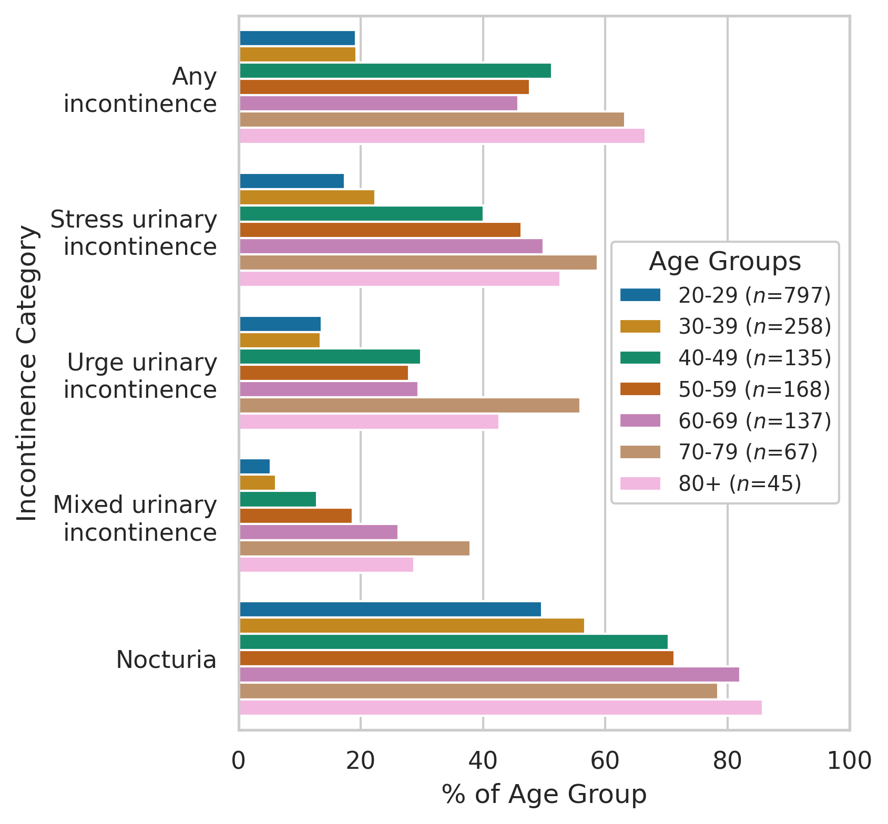

# Nullip Incontinence Analysis and Plotting Code

This repository contains all the analysis and plotting code used for the manuscript:

*Prevalence and risk factors for urinary incontinence in nulliparous women: a contemporary, population-based cohort study*

Nathalie Kupfer, MD, Aisling Clancy, MD, MSc, MPH, Finlay Maguire, PhD, Jocelyn Stairs, MD, MPH

## File Description

The data analyses in this paper (e.g., parsing, cleaning, odds ratio, and logistic regression analyses) were performed used STATA v16.1 using the included `.do` file
To reproduce these analyses download and extract the NHANES dataset into the `NHANES` folder:

    NHANES_nullip_incontinence_analysis.do

The jupyter notebook contains code to generate the summary figure of age-stratified nullip incontinence prevalence (using the seaborn v0.11.1, matplotlib v3.5.1, and pandas v1.2.4):

    nullip_incotinence_plot.ipynb 

The hand-processed/tidied xlsx of the age prevalence data generated in the .do file and used to create the figure can be found in `intermediate_data/`

    intermediate_data/nullip_incontinence_age_stratified_prevalence_hand_processed.xlsx

Finally, the figure generated from this xlsx using the notebook is in `figures/`

    figures/nullip_by_category.png

